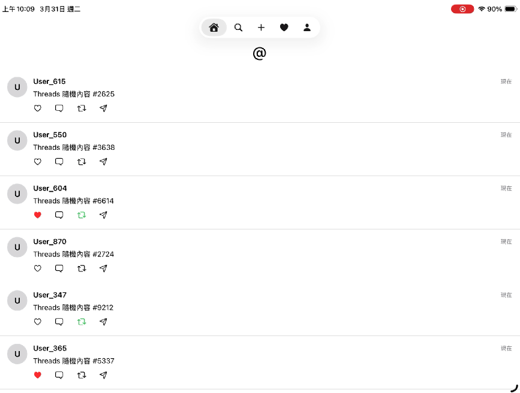
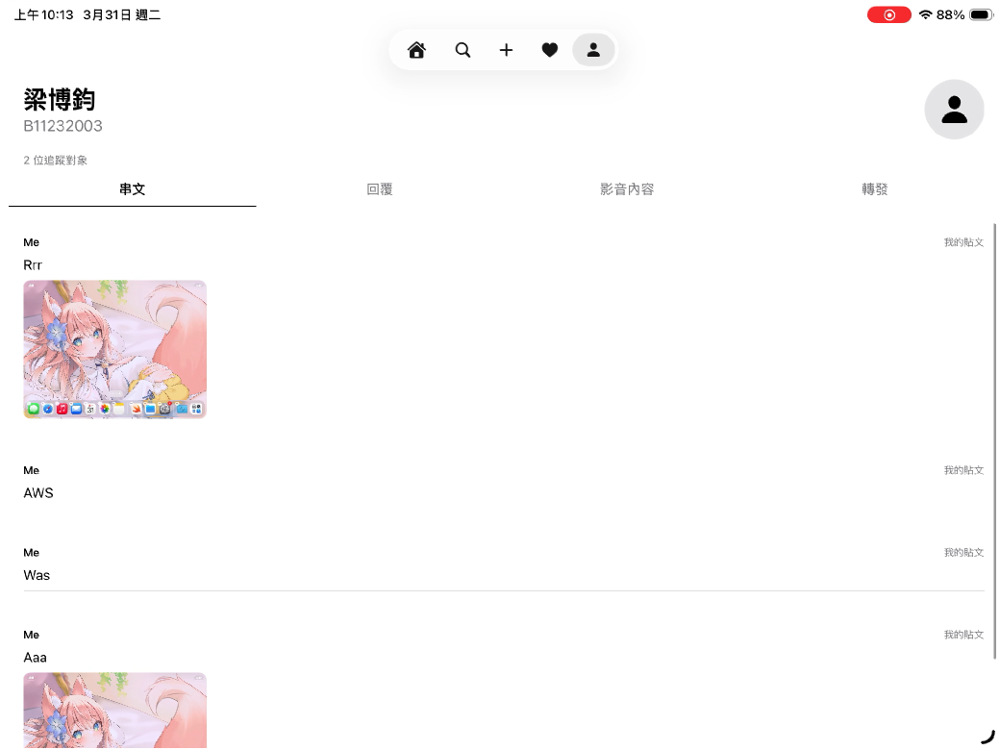
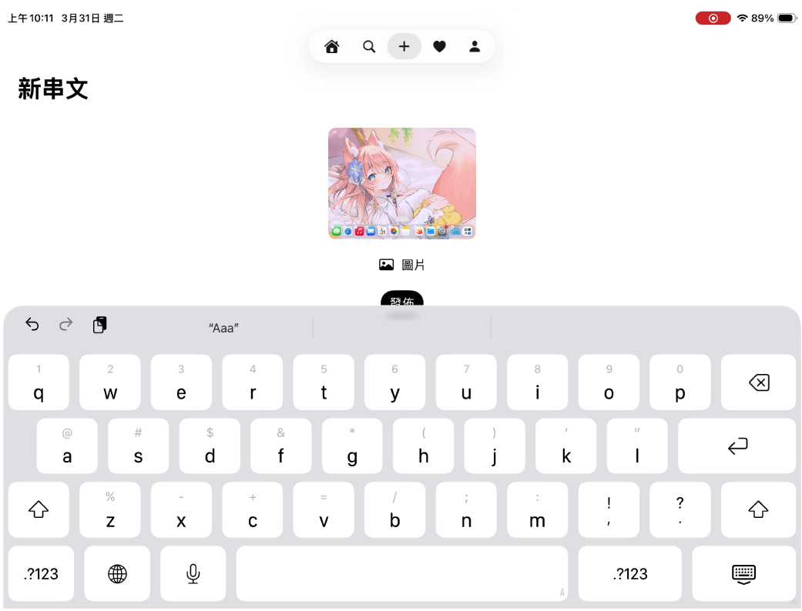

# iOS Threads Clone (SwiftUI)

  
  
  

## Overview
A fully functional social media application inspired by Threads, built entirely with modern **SwiftUI**. This project demonstrates comprehensive iOS development skills, ranging from complex UI navigation and state management to local data persistence, replicating core features of mainstream social platforms.

## Core Features & Engineering Highlights

* **Modern Navigation & UI Architecture:** Utilized SwiftUI's `NavigationStack` and `TabView` to implement a seamless 5-screen full-page navigation system. Includes custom bottom-sheet drawers for displaying follower lists.
* **Rich Post Interactions:** Users can dynamically interact with the feed through Liking (saving), Replying, Reposting, and Sharing (which simulates copying the post link to the clipboard).
* **Content Generation & Media Support:** Features an algorithm to randomly generate timeline feeds upon app refresh. Supports creating new posts with text and image attachments from the local photo album.
* **Follower System:** Implemented a robust user discovery and follow/unfollow mechanism, dynamically updating the recommended users list based on interaction states.
* **Local Data Persistence:** Leveraged `UserDefaults` as a local database to persistently store app states, including the user's generated posts, media content, liked items, replies, reposts, and the active following list, ensuring data remains intact across app launches.

## Tech Stack
* **Framework:** SwiftUI
* **Language:** Swift
* **Data Storage:** UserDefaults
* **Environment:** iOS 17+, Xcode 15+

## Installation & Usage
This project is built as a Swift Playgrounds App package (`.swiftpm`). It can be run natively on an iPad or seamlessly on a Mac.

1. Clone this repository to your local machine.
2. **On Mac:** Double-click the `ThreadsClone.swiftpm` file to open it directly in **Xcode**. Select a Simulator and hit `Cmd + R` to run.
3. **On iPad:** Airdrop or download the `.swiftpm` file to your device and open it using the **Swift Playgrounds** app to build and run natively.
